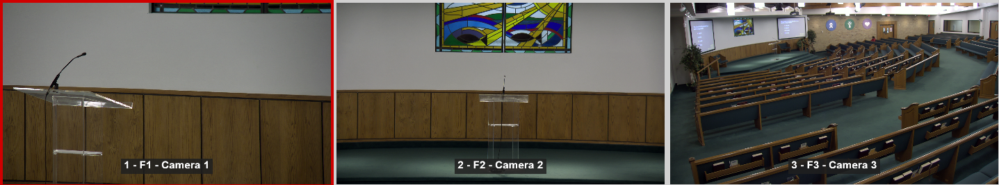

# Camera Presets

Using the camera RCC4000 PTZ Controller, the camera presets can be selected by pressing the camera select button, followed by the preset button.  For example, to set Camera 2 to Preset 1, press: "CAM 1" followed by "PRESET 1"

## Preset 1
This preset zooms in on the speaker at the podium.

## Preset 2
This preset zooms out slightly from the podium, with Cameras 1 & 2 2 covering the sides of the "preaching zone" of the stage.

## Preset 3
This preset has a wide-angle shot of the whole room on Camera 3, and slight variations of the stage on Cameras 1 & 2.

## Preset 4
This preset covers the Children's Corner with Cameras 1 & 2, and zooms out to encompass the whole stage using Camera 2

[<- back](README.md)
