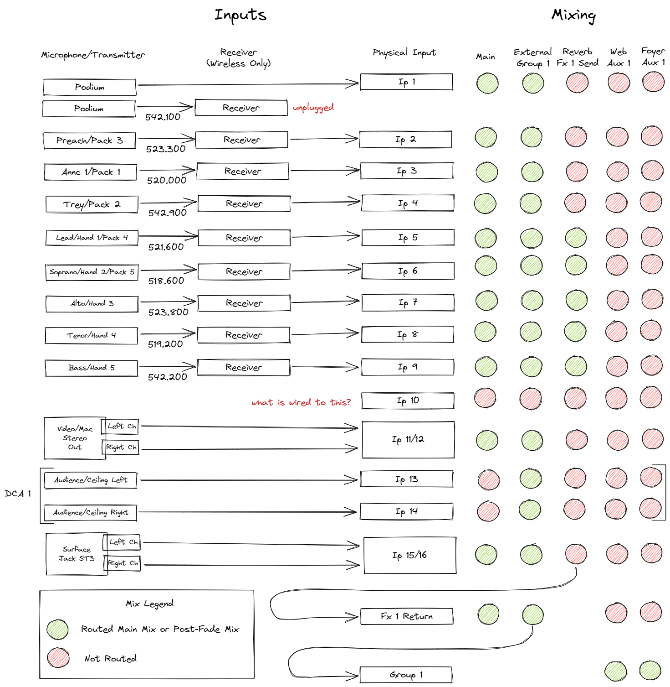

# Proposed Updates

1. Merge Aux 1 and Aux 2.  What's good for the web is good for the Lobby.  They want the same mix.
2. Set channels present in the live show to post mixes.  This will ease the burden on the operator in keeping a good mix on Aux.
3. Pull unneeded inputs from the Fx1 send to prevent accidental reverb on non-choral parts.

[<- back](./README.md)
