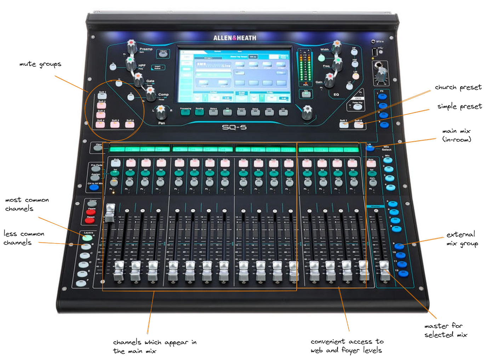
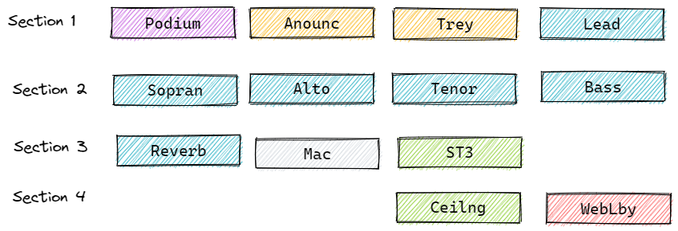

# Proposed Updates

## Problem Statement

The current board is designed with an experienced operator in mind.  There are three layers of mix to track and channels behave differently on each.  This is not a burden for well-trained and experienced operators, but it is a challenge for new operators.

## Requirements

The primary goal of these updates is to reduce to cognitive load on the operator while in-service.  

The secondary goal is to make it possible to create a "basic" level of training, which is adequate to get through a Sunday morning service (similar to how the other two stations have both a basic and advanced training level).

Finally, it is a requirement that all channels in operation be assigned (preferably on layer A or B), so that an advanced opererator still has fine control over all levels when needed.

## Proposal Summary

1. Create the external group mix, which then routes to Aux 1 and Aux 2.
2. Set channels present in the live show to post mixes.
3. Pull unneeded inputs from the Fx1 send to prevent accidental reverb on non-choral parts.
4. Add the ceiling mics to a DCA to simplify strip assignment

## Inputs and Mixing

The proposed routing improves the operation of the board by leveraging post mixes on the external group and then sending that signal to web and lobby mixes.  Since we are all-vocal, we generally want the same mix in the lobby as we have on the stream, but we still want to retain control of the final level.  

The external group mix would require very little adjustment once set.  Tweaks to individual main mix levels in-service (such as minor adjustments due to quiet announcers or enthusiastic singers) would then trickle down to the external group mix automatically. 

The final web and lobby levels can still be set separately on their respective aux.

## Strip Assignment

This layout reduces the number of strips to just what is needed for regular board operation.  Some minimization is also gained by assigning a DCA to the ceilings mics, which would almost always be moved together anyway.

The first three groups of strips are channels which are present in both the main and web mix.  The fourth group is set aside to manage the external mixes, so that the operator does not have to switch mixes to make the most common in-service adjustments for those outputs (adjustment or muting of the ceiling mics, or overall web/foyer levels).

The most common channels in Layer A contain everything an operator trained at the basic level needs to run service.    Layer B would only be needed for the individual channels inside of the DCA, inputs with open jacks that are not otherwise used, FX sends, and similar channels which are typically set-and-forget.

## Possible Future Enhancement

A set of stage monitors or in-ear monitoring system would be a beneficial improvement, but it is not funded for this year.  Since the praise team does not stand on stage, the monitor is of limited utility for service.  Given our current tendencies, it's main use would be during special events like VBS.

[<- back](./README.md)
