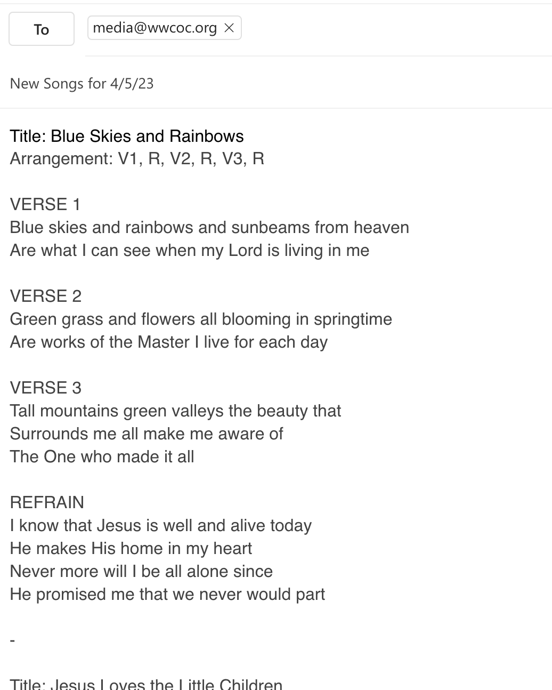
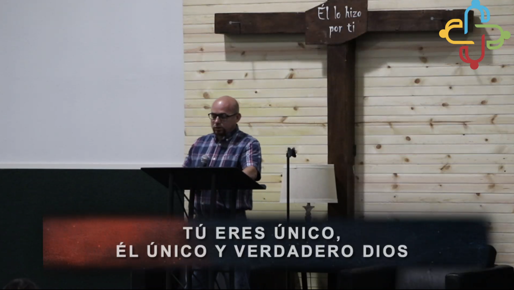
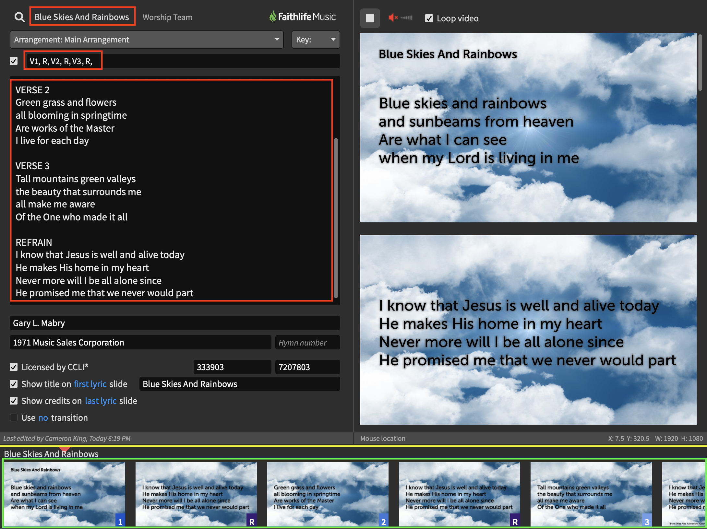

# Sending the Media Team Lyrics

If we don't have your song in our database already, this is the best way to send us the lyrics.

Please email a copy of the lyrics to media@wwcoc.org.  They can be contained in a doc or just pasted into the email itself, as long as we can read the lyrics.  Please make sure it's a format we can copy and paste (not a photo of text).

(Is this song for Siempre Familia?  Skip to the bottom for specifics on that.)

## Best Format

This is the best way to send us lyrics.  Our software understands this format natively, and makes it very easy for the operater to skip around the song or to skip verses.

If you have a particular background you want displayed behind the song, send that along as well.  Otherwise, the slide will have white text on a black background.  (...or maybe something pretty, if the person who enters the song feels inspired!)

If you are curious _why_ we prefer this specific format, please skip to the bottom of this document for an illustration of how the software we use interprets song lyrics.

    Title: Blue Skies and Rainbows
    Arrangement: V1, R, V2, R, V3, R

    VERSE 1
    Blue skies and rainbows and sunbeams from heaven
    Are what I can see when my Lord is living in me

    VERSE 2
    Green grass and flowers all blooming in springtime
    Are works of the Master I live for each day

    VERSE 3
    Tall mountains green valleys the beauty that
    Surrounds me all make me aware of
    The One who made it all

    REFRAIN
    I know that Jesus is well and alive today
    He makes His home in my heart
    Never more will I be all alone since
    He promised me that we never would part

The software understands the following sections:
- Verse: V, V1, 1
- Chorus: C, C1
- Pre-chorus: P, P1
- Bridge: B, B1
- Tag: T, T1
- Interlude: I, I1

Here is an example email someone might compose to send us some songs.  (It's ok to include multiple songs in one email!)

## Alternate Format

If a song does not have an easily defined structure, you can forgo the section labels and give us the song in this simplified format instead.

    Title: Blue Skies and Rainbows

    Blue skies and rainbows and sunbeams from heaven
    Are what I can see when my Lord is living in me

    I know that Jesus is well and alive today
    He makes His home in my heart
    Never more will I be all alone since
    He promised me that we never would part

    Green grass and flowers all blooming in springtime
    Are works of the Master I live for each day

    I know that Jesus is well and alive today
    He makes His home in my heart
    Never more will I be all alone since
    He promised me that we never would part

    Tall mountains green valleys the beauty that
    Surrounds me all make me aware of
    The One who made it all

    I know that Jesus is well and alive today
    He makes His home in my heart
    Never more will I be all alone since
    He promised me that we never would part

## Siempre Familia Songs

On Sunday mornings, Siempre Familia runs a Live Stream with the bottom third scrolling song lyrics.  This means that song slides should be limited to 2-3 lines of text as a maximum (or else the text gets too small to read).

For example:

Here is an example of a song that breaks up the text into 2 line sections, so that it will fit in the bottom third.

    Title: Tu Fidelidad
    Arrangement: C1, V1, C1, V1

    Chorus 1
    Tu fidelidad es grande,
    Tu fidelidad incomparable es,

    Nadie como Tú bendito Dios,
    Grande es Tu fidelidad.

    Verse 1
    Tu amor por mi es grande,
    Tu amor por mi incomparable es,

    Nadie como tu bendito Dios,
    Grande es tu amor por mi.

## Why This Format?

When verses are in this particular format, we can save multiple arrangement presets and the operator can jump to the third verse just by pressing "3" on the keyboard.

Here is an example:

You can see the various parts of the song lyrics hilighted in red.  This includes the title, the arrangement, and the lyrics themselves.

In green at the bottom of the screenshot, you can see how Proclaim organizes the slides.  The operator can see at a glance which slides correspond to which parts of the song.  If we need to skip a verse or repeat some part, we can do so on the fly easily.

Thank you so much for partnering with us on this!

[<- back](README.md)
