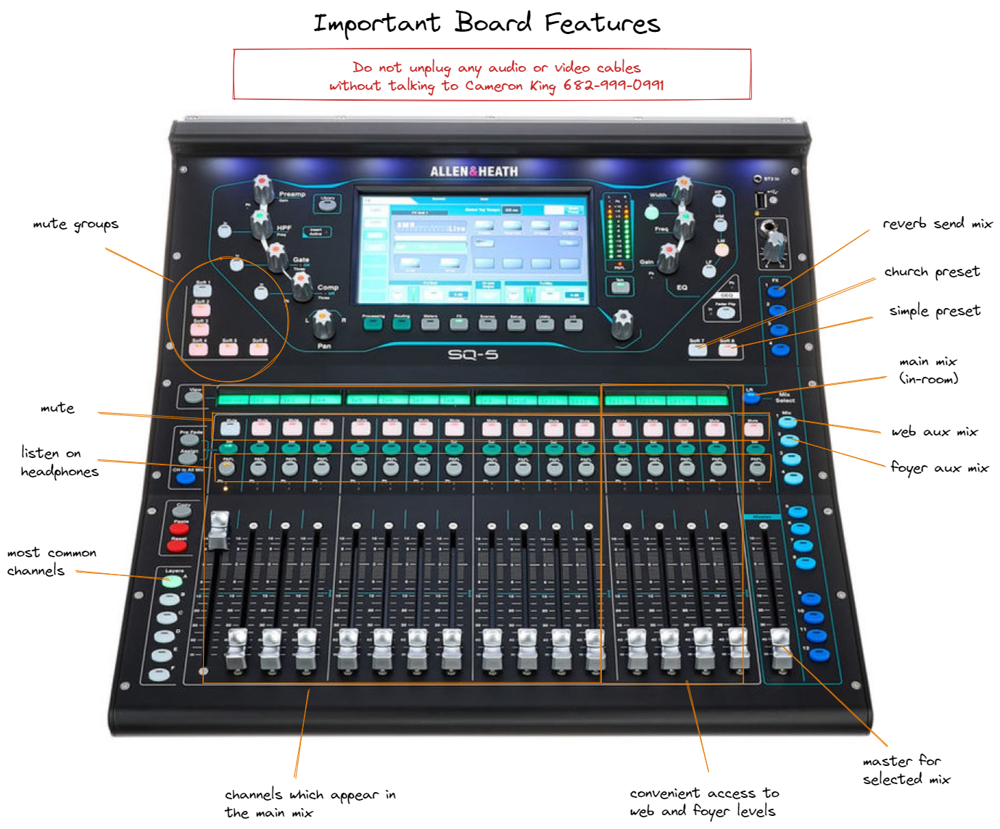
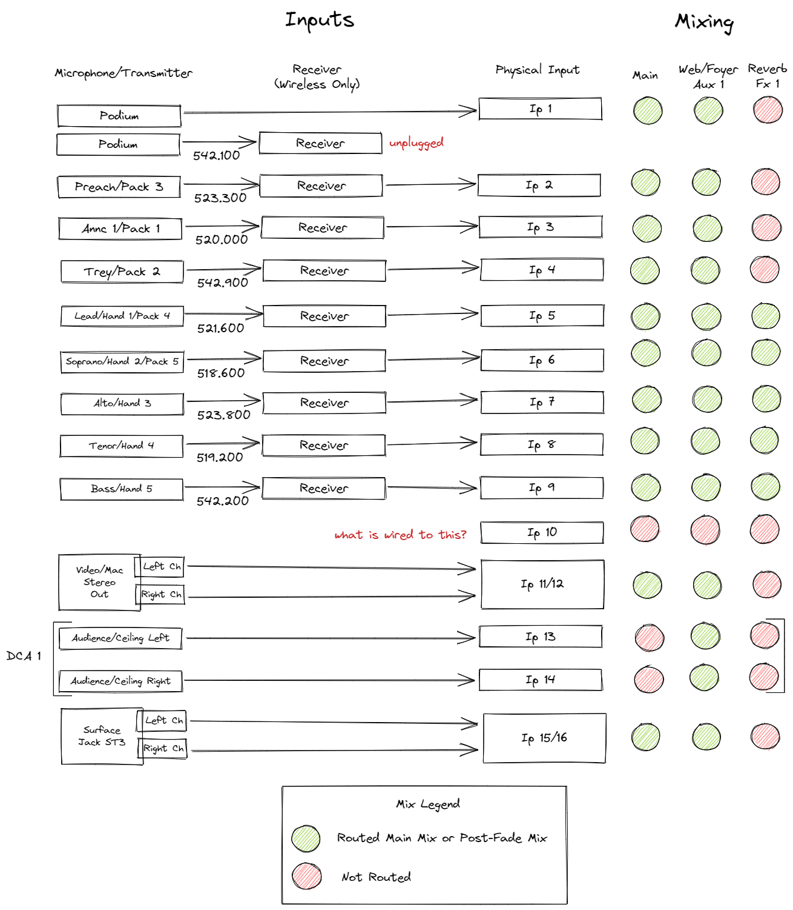

# Church Soundboard

## Preset Summary

The church preset is a variation on the [Simple Preset](soundboard-simple.md), except that the reveb send has been extended to include all 5 handheld microphones, and each microphone has a custom EQ profile depending on it's typical use during Sunday morning worship.  Additionally, the reverb, ceiling mics, and foyer are unmuted by default and configured slightly differently.

## Sunday Soundcheck Mixing

The preset contains settings which are probably "good enough" for most Sundays.  But each combination of singers is different, so this procedure will help you fine-tune the mix each Sunday.

- This is easiest to do on a longer song that the team is already comfortable with and knows well
- Press PAFL to zero in on a channel using the headphones if needed
- The headphone volume can be adjusted with a knob on the top right of the board

Main Mix

1. Reset the board (Soft Key 7, Layer A, Main Mix)
2. Ensure mics are on, with 2 or 3 bars of battery, and are unmuted on both the board and the mic
3. Adjust Lead, Soprano, Alto, Tenor, and Bass so that the overall volume is strong, but comfortable
4. One by one, adjust all 5 so that they are approximately equal in percieved volume
5. Raise Lead slightly so that it can be clearly heard above the others

Web and Lobby Mixes

1. Switch to Web Mix
2. Press PAFL on the Web Mix and use headphones
3. Lower Lead so that it is approximately equal in volume to the other singers
4. Switch to Lobby Mix
5. Make the same adjustment
6. Switch back to Main Mix

Note on audience fill:

The left ceiling mic is configured at -35dB and is unmuted at all times.  This is to capture general room ambiance and faint laughter from the audience.

The right ceiling mic is configured 0dB and is bound to the vocal mute group.  This mic captures a selection of audience singers and feeds that to the lobby and web mix.  It is silent when the vocal group is muted.

## Board Overview

## Inputs and Mixing

As of May 2022

[<- back](README.md)
