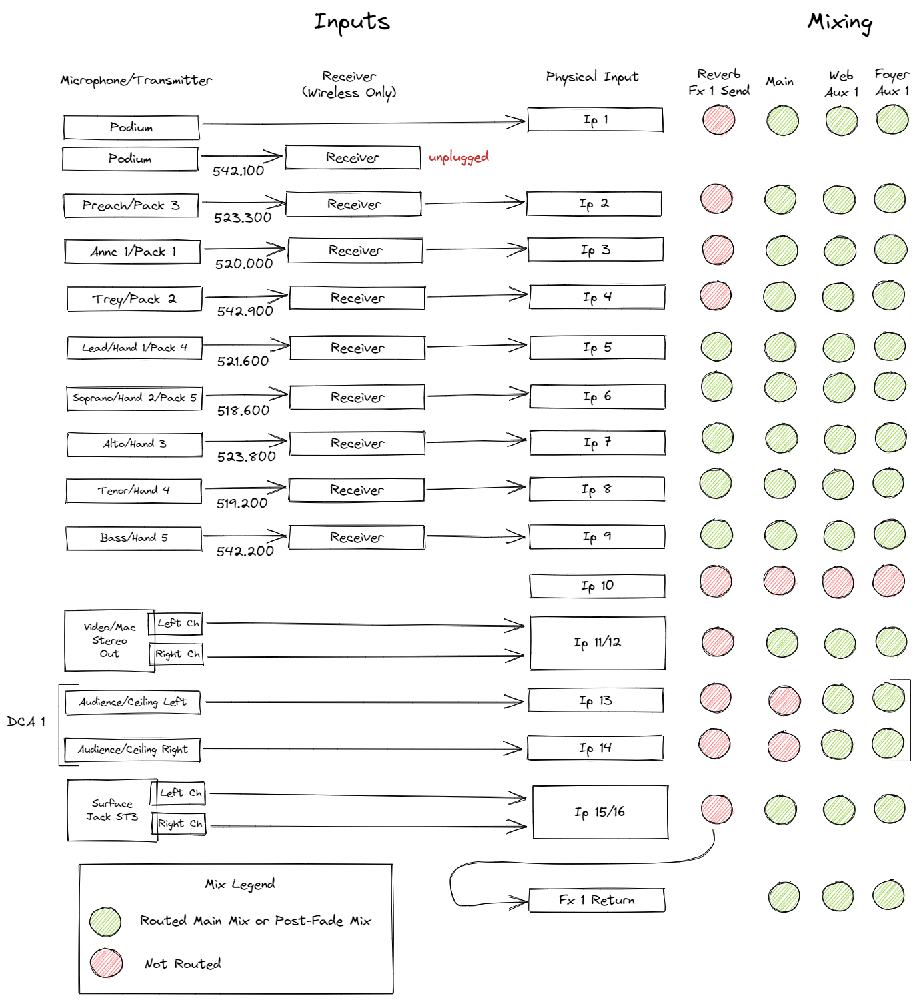

# Simple Soundboard

## Preset Defaults

When loading the Simple preset (Soft Key 8), the board will be set as follows:

- Belt Pack 1-5 and Handheld 1-5 are unmuted and ready to use
  - Belt Pack 4 and Handheld 1 cannot be on at the same time, choose one!
  - Belt Pack 5 and Handheld 2 cannot be on at the same time, choose one!
- The reverb effect on Handheld 3-5 is muted
- The audio from the Macintosh is muted
- The audio input jack on the mixer surface labeled ST3 is muted
- The ceiling microphones (which route to the foyer) are muted
- The Foyer is muted

Consider muting microphones which are not in use, just in case of radio interferance.

## Board Overview and Block Diagram

## Inputs and Mixing

As of May 2022

[<- back](README.md)
