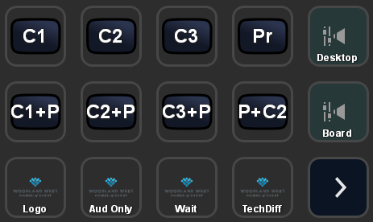
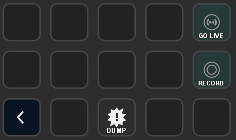

# StreamDeck

The StreamDeck brings the following buttons up to the desktop, so you can change camera angles easily.

The eight buttons C1 through P+C2 correspond to the top eight scenes in OBS... laid out the same way that they are displayed when looking at the MultiView window.

The two audio buttons Desktop and Board control whether the desktop audio or sound board are muted or not.

The four logo buttons at the bottom are:

- Logo - just a plain WW logo on a white background
- Aud Only - logo with a message [Audio Only]
- Wait - logo with a message [Please Wait]
- TechDif - logo with a message [We are experiencing technical difficulties]

The second page contains stream controls.

- GO LIVE - starts streaming and recording.  Press it again and the stream will begin the shutdown process (which takes 20 seconds because we run on a delay).
- RECORD - can start or stop recording separately from the streaming.
- DUMP - Immediately shuts down the streaming feed, and discards the 20 second delay.

(DUMP should only be used if something happens in service which requires us to kill the feed.  Hopefully, things that will never happen...  but if needed, there's the button for it.)

We can also put "overflow" or less common scenes on this page.  You can see that there are eight more spots where they would fit nicely.  Perhaps this would be useful while recording VBS, with title cards or something?

[<- back](README.md)
